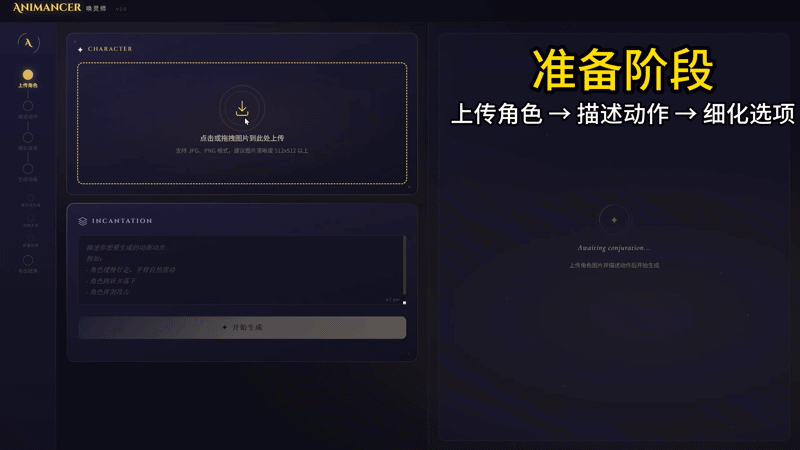
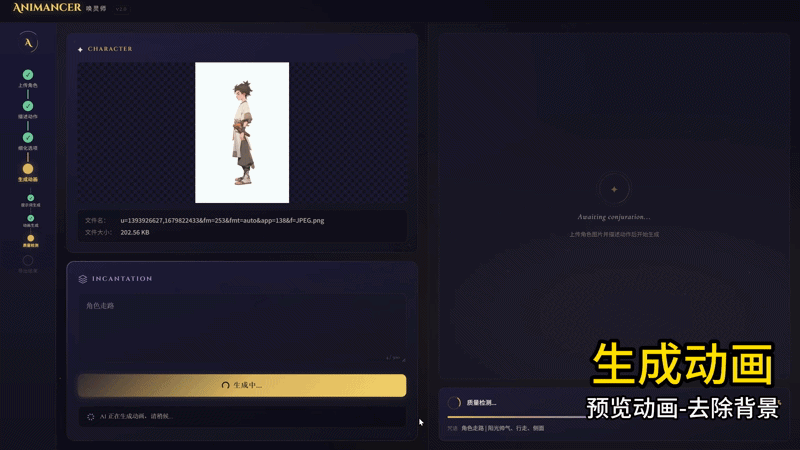
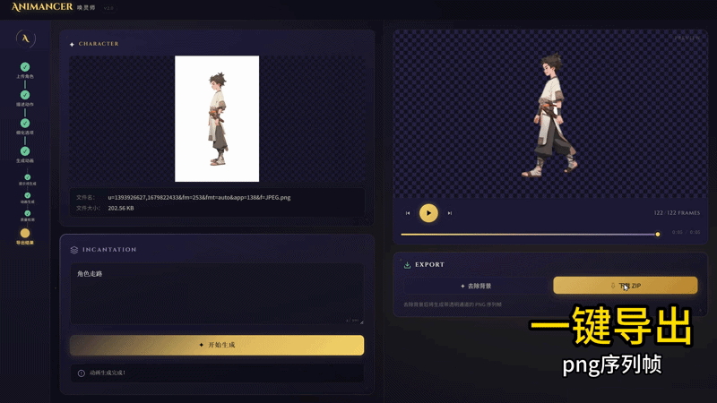
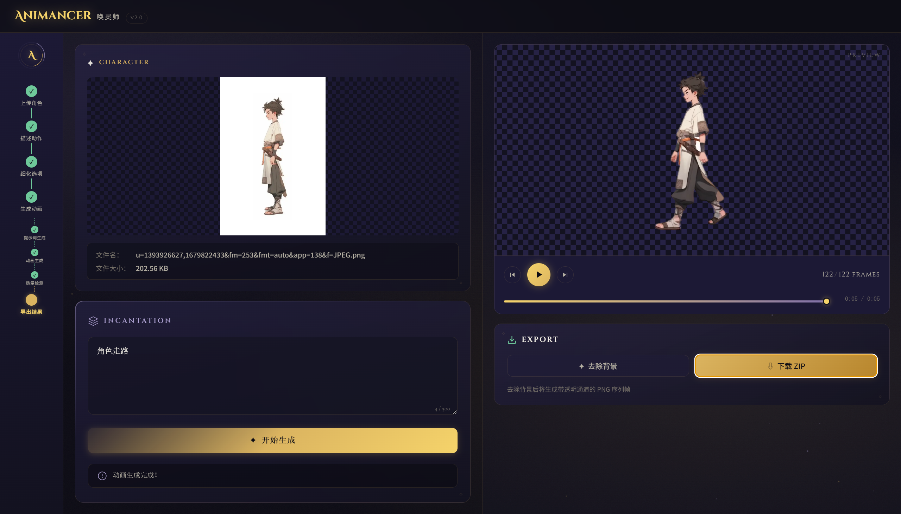

# Animancer 唤灵师

> 基于 AI 的 2D 角色动作动画生成工具，专为横版游戏设计

上传静态 2D 角色图片，输入动作描述，自动生成动画视频并移除背景。







## 🎯 功能特性

- **AI 动画生成**：上传图片 + 动作描述 → 自动生成动画视频
- **答题卡式追问**：3 个固定问题（角色性格、动作类型、镜头角度），点击选择即可
- **质量检查**：AI 自动评估生成结果
- **背景移除**：一键移除视频背景，生成透明 PNG 序列帧
- **WebM 预览**：透明背景视频可直接在浏览器预览（棋盘格背景）
- **ZIP 下载**：PNG 序列帧打包下载，方便导入其他工具

## 🆕 V2.0 更新 - 魔法工坊主题

### 全新视觉设计

采用暗金魔法主题（Arcane Workshop），沉浸式创作工具体验：



### 前端视觉重构

- **暗金主题**：深色底 + 琥珀金主色 + 薰衣草紫辅色
- **三栏布局**：进度侧栏 + 输入面板 + 预览面板
- **5 步进度指示**：上传 → 描述 → 细化 → 生成 → 导出
- **粒子背景**：金色/紫色粒子上浮效果
- **入场动画**：staggered reveal 渐入效果
- **自定义组件**：魔法阵上传区、咒语输入框、答题卡、播放器

### 后端优化

- **2D 横版游戏约束**：SAA System Prompt 新增侧视角、固定镜头、循环动作等约束
- **循环播放支持**：传尾帧到 Kling API（首帧=尾帧），动画可无缝循环
- **真实质检启用**：5 帧关键帧 LLM 评估（姿态/一致性/画质）
- **Kling v2 模型**：默认模型升级，支持 v2.1 / v2.5-turbo / v2.6 / v3

---

## V1.5 更新

### 答题卡模式

将开放式追问改为**选择题答题卡**，专为 2D 横版游戏优化：

| 问题 | 选项 |
|------|------|
| 角色性格 | 活泼可爱、阳光帅气、冷血无情、其他（自填） |
| 动作类型 | 行走、跑步、跳跃、攻击 |
| 镜头角度 | 正面、侧面 |

**交互流程**：
```
卡片1（角色性格）→ 选择 → 卡片2（动作类型）→ 选择 → 卡片3（镜头角度）→ 选择 → 开始生成
```

**答题进度显示**：
- ✅ 已答完的问题（显示答案）
- 🔄 当前答题中
- ⏳ 待选择

### 技术改进

- 固定问题模板，不再依赖 LLM 生成问题
- 后端答题进度日志追踪
- JSON 解析容错（支持单引号字符串）
- 前端状态同步优化

---

## 🛠️ 技术栈

```
前端: Vue 3 + Vite + Pinia
后端: FastAPI (Python)
     ├── MA (主 Agent: 流程编排)
     ├── SA_A (Prompt 生成)
     ├── SA_G (视频生成 - Kling API)
     └── SA_QC (质量检查)
外部服务:
     ├── 智谱 GLM-4-Flash (LLM)
     ├── 可灵 AI (图生视频)
     ├── RMBG-1.4 (背景移除)
     └── FFmpeg (视频处理)
```

## 🚀 快速开始

### 环境要求

- Python 3.10+
- Node.js 18+
- FFmpeg（可选，会自动安装 imageio-ffmpeg）

### 后端启动

```bash
cd backend

# 创建虚拟环境
python -m venv venv
source venv/bin/activate  # Windows: venv\Scripts\activate

# 安装依赖
pip install -r requirements.txt

# 配置环境变量
cp .env.example .env
# 编辑 .env 填入 API 密钥

# 启动服务
uvicorn app.main:app --reload --port 8000
```

### 前端启动

```bash
cd frontend

# 安装依赖
npm install

# 启动开发服务器
npm run dev
```

### Electron 开发模式

完整开发需要启动 3 个服务：

```bash
# 终端 1：启动后端
cd backend
source venv/bin/activate  # Windows: venv\Scripts\activate
uvicorn app.main:app --host 127.0.0.1 --port 8000

# 终端 2：启动前端开发服务器
cd frontend
npm run dev

# 终端 3：启动 Electron
cd electron
npm install  # 首次需要安装依赖
npm run dev
```

访问 http://localhost:5173 或通过 Electron 窗口开始使用。

## ⚙️ 环境变量

在 `backend/.env` 中配置：

```env
# 智谱 AI (LLM)
ZHIPU_API_KEY=your_zhipu_api_key

# 可灵 AI (视频生成)
KLING_ACCESS_KEY=your_kling_access_key
KLING_SECRET_KEY=your_kling_secret_key
```

## 📡 API 接口

| 接口 | 方法 | 说明 |
|------|------|------|
| `/api/generate` | POST | 开始生成动画 |
| `/api/answer` | POST | 回答 AI 追问 |
| `/api/status/{id}` | GET | 查询生成状态 |
| `/api/remove-bg` | POST | 移除视频背景 |

### 生成动画

```
POST /api/generate
Content-Type: multipart/form-data

file: <图片文件>
prompt: <动作描述>

Response:
{
  "session_id": "xxx",
  "status": "questioning" | "generating" | "completed",
  "questions": [...],           // status=questioning 时
  "video_url": "/videos/xxx.mp4"  // status=completed 时
}
```

### 回答追问 (V1.5)

```
POST /api/answer
Content-Type: application/json

{
  "session_id": "xxx",
  "answers": [
    { "question_id": "character_personality", "selected": "活泼可爱" },
    { "question_id": "action_type", "selected": "攻击" },
    { "question_id": "camera_angle", "selected": "正面" }
  ]
}
```

### 移除背景

```
POST /api/remove-bg
Content-Type: application/json

{
  "session_id": "xxx"
}

Response:
{
  "status": "completed",
  "preview_url": "/frames/xxx_rmbg/preview.webm",
  "download_url": "/exports/xxx_frames.zip",
  "frame_count": 122
}
```

## 📁 项目结构

```
Animancer/
├── frontend/                # Vue 3 前端
│   ├── src/
│   │   ├── views/          # 页面
│   │   ├── components/     # UI 组件
│   │   │   ├── QuestionCard.vue      # 答题卡组件
│   │   │   ├── StepSidebar.vue       # V2 进度侧栏
│   │   │   ├── ParticleCanvas.vue    # V2 粒子背景
│   │   │   └── GenerationProgress.vue # V2 生成进度
│   │   ├── stores/         # Pinia 状态管理
│   │   └── api/            # API 封装
│   └── package.json
├── backend/                 # FastAPI 后端
│   ├── app/
│   │   ├── agents/         # Agent 模块
│   │   │   ├── ma.py       # Master Agent - 流程编排
│   │   │   ├── sa_a.py     # Sub-Agent A - Prompt 生成 + 问题模板
│   │   │   ├── sa_g.py     # Sub-Agent G - 视频生成
│   │   │   └── sa_qc.py    # Sub-Agent QC - 质量检查
│   │   ├── routers/        # API 路由
│   │   ├── services/       # 核心服务
│   │   └── main.py         # FastAPI 入口
│   ├── data/               # 运行时数据 (gitignore)
│   └── requirements.txt
├── docs/images/            # 文档图片
└── README.md
```

## 🔄 工作流程

```
用户上传图片 + 动作描述
        ↓
    SA_A 分析描述
        ↓
  ┌─────────────┐
  │ 信息充分？   │
  └──────┬──────┘
         │
    ┌────┴────┐
    ↓         ↓
   是        否
    ↓         ↓
    │     返回答题卡（3个选择题）
    │         ↓
    │     用户选择/填写
    │         ↓
    └────→ 提交答案 → 继续
              ↓
      SA_G 生成视频 (Kling AI)
              ↓
      SA_QC 质量检查
              ↓
        返回视频 URL
              ↓
      用户点击"去除背景"
              ↓
      RMBG 移除背景 → PNG 序列
              ↓
      生成 WebM 预览 + ZIP 下载
```

## 📦 外部依赖

| 依赖 | 用途 | 获取方式 |
|------|------|---------|
| 智谱 GLM API | LLM | [open.bigmodel.cn](https://open.bigmodel.cn) |
| 可灵 Kling API | 图生视频 | [klingai.kuaishou.com](https://klingai.kuaishou.com) |
| RMBG-1.4 | 背景移除 | `pip install rembg` |
| imageio-ffmpeg | 视频处理 | `pip install imageio-ffmpeg` |

## 📜 License

MIT

---

**Animancer 唤灵师** — 让 2D 角色动起来！
